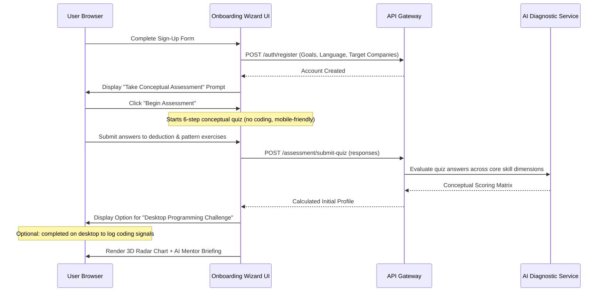

# User Interaction Flows - PatternForge AI

This document details the step-by-step user interaction flows for **PatternForge AI**, mapping the visual designs defined in [design-system.md](file:///c:/Users/Hari%20Ram/Documents/leetcode%20app/Architecture-docs/design-system.md) to the technical architecture specified in [frontend.md](file:///c:/Users/Hari%20Ram/Documents/leetcode%20app/Architecture-docs/frontend.md) and the user stories outlined in [user-stories.md](file:///c:/Users/Hari%20Ram/Documents/leetcode%20app/project-docs/user-stories.md).

---

## 1. Onboarding & AI-Powered Diagnostic Flow

*Targets User Stories: `US-001`, `US-002`, `US-003`, `US-004`, `US-051`*

This flow introduces new users to the platform, collects goal parameters, and establishes an objective baseline profile of their problem-solving ability.

### Step-by-Step Interactions

1. **Sign-up & Goal Form:**
   - Input fields for Email, Password, Preferred Coding Language, and Interview Target Companies (multi-select list with checkboxes for Google, Amazon, Microsoft, Uber, etc.).
   - Slider to select "Days until first interview" (from 14 days to 180 days).
   - Click "Submit" to trigger smooth slideout fade of the sign-up container.
2. **Diagnostic Assessment Setup:**
   - Screen overlays with a warm cream/charcoal presentation modal: *"Before we write code, let's understand how your mind solves problems."*
   - Click "Begin Test" to initiate the 6-step conceptual quiz.
3. **The Multi-Dimensional Test:**
   - **Test 1 (Pattern Recognition):** Displays raw input/output patterns without text descriptions. User selects the matching algorithmic category from an elegant floating deck of cards.
   - **Test 2 (Observation Identification):** Displays a brief problem statement. User is presented with 10 statement items and must check the 4 items that are mathematically critical constraints or edge invariants.
   - **Test 3 (Complexity Evaluation):** User looks at a pseudocode block and inputs the tightest big-O complexity using a slider widget.
   - **Optional Programming Challenge:** Post-quiz, the user can initiate a 1-2 coding task challenge on desktop to log behavioral signals (observations, execution speeds).
4. **Diagnostic Results Display:**
   - Upon completion, the screen displays a shimmering loader for 2 seconds.
   - Fades in a dashboard rendering:
     - **A 6-Dimensional Radar Chart (Recharts):** Dimensions: *Pattern Recognition, Observation Quality, Formula Discovery, Optimization Ability, Speed, and Consistency*. Renders from the combined conceptual quiz and optional challenge profiles.
     - **The AI Mentor Profile Briefing:** A text card explaining the user's primary failure mode (e.g., *"Arjun, your pattern selection is high (85%), but your edge-case observation quality is low (30%). You tend to code before verifying assumptions."*).
     - **CTA Button:** "Go to Personalized Roadmap" slides the user to their daily practice dashboard.

---

## 2. The Thinking-First Practice Flow (The Core Loop)

*Targets User Stories: `US-005` to `US-013`, `US-015` to `US-018`, `US-029` to `US-032`, `US-046` to `US-048`*

This is the central workspace flow. It enforces the "thinking-before-coding" pipeline, blocking access to the editor until cognitive phases are passed.

### Phase 1: Problem Launch & Reading
- **User Action:** User clicks on "Solve Challenge" from their personalized roadmap.
- **UI State:** Workspace loads. The Left Pane displays the problem in Georgia serif font. The Right Pane is locked, rendering a warm sepia card: *"Stage 1: Read the problem carefully. The code editor is locked."*
- **Backend Action:** Emits `problem_opened` event; initializes `learning_sessions` entry.
- **Trigger to Next Phase:** An active "I Have Read the Problem" CTA button at the bottom of the description unlocks after 30 seconds. A "Bypass Lockout" text link allows users to skip the timer instantly (issuing a soft telemetry flag for analytical tracking rather than hard blocking). Clicking either slides the right-hand panel into **Pattern Discovery**.

### Phase 2: Pattern Discovery Gate
- **User Action:** The user scans the left description. The right pane displays a selection grid of common algorithmic patterns (e.g., *Sliding Window, Binary Search, 2-Pointers, Backtracking*).
- **UI Action:** User selects a card (it highlights with an amber-gold border) and is prompted: *"Explain in 2–4 sentences why this pattern applies here."* The user types their justification.
- **AI Feedback Trigger:** User clicks "Submit Hypothesis". The interface renders a skeleton loading state during asynchronous AI evaluations to prevent tab freezes.
  - **Case A (Incorrect Guess):** An overlay alerts: *"Clue: Look closer at the constraint inputs..."* and reveals a single highlighted sentence in the problem description pane. The user is allowed one reguess.
  - **Case B (Correct Guess):** The pattern card flashes green (`emerald-500/10`) with a spring-based scale-up micro-animation, unlocking the next step.
- **Timer Event:** Tracks `time_to_pattern`.

### Phase 3: Structured Observation Checklist
- **User Action:** The right pane transitions into an inputs wizard.
- **UI Interaction:** The user is presented with 4 text boxes under category tabs:
  - *Inputs/Outputs Properties*
  - *Constraint Implications (e.g., n = 10^5 implies O(N log N) or O(N))*
  - *Edge Cases (e.g., empty array, negative numbers, overflow limits)*
  - *Brute-Force Baseline Complexity*
- **Submission & Scoring:** The user clicks "Submit Observations". The panel displays a shimmering skeleton progress loader while the AI asynchronously evaluates the inputs:
  - Renders an observation score bar (e.g., `82/100`).
  - Highlights a checklist of **Critical Observations** (revealing which items the user documented and which ones they missed, such as *"elements can be negative"*).
  - Missed observations are automatically added to the user's mistake tracking array.

### Phase 4: Complexity Commitment
- **User Action:** User selects their target Time Complexity (e.g., $O(N)$) and Space Complexity (e.g., $O(1)$) from two dropdown menus styled like Claude's model selector.
- **Unlocking:** Click "Proceed to Coding" triggers a slide-out transition. The right pane splits, sliding down the test console and initializing the Monaco Editor.

### Phase 5: Active Coding & Compiling
- **UI Layout:** The workspace splits into three frames (Left: problem description, Right-Top: Monaco Editor, Right-Bottom: test cases terminal).
- **Universal Code Execution Pill:** Floating at the bottom center of the editor pane:
  - Clicking `+` expands a mini-drawer to load default starter variables or sample arrays.
  - Language selector dropdown allows switching between Python, Java, C++, JS.
- **Run Draft Action:** Clicking the primary orange arrow button initiates execution:
  - The compiler output tab at the bottom displays a shimmering wave animation overlay (`shimmer-console`).
  - On verdict receipt, the console area slides up displaying test cases (Expected Output vs User Output) side-by-side with muted red/green flags.

### Phase 6: Code Submission & Polling
- **User Action:** User clicks "Submit Code" on the Universal Pill.
- **UX Sequence:** The editor becomes read-only. A full-screen translucent overlay dims the workspace, displaying: *"Running 142 hidden tests..."* with a soft, breathing pulse indicator.
- **Completion Verdict:**
  - **Case A (Pass):** Confetti micro-interaction triggers; screen transitions to **Solution Path Analyzer**.
  - **Case B (Fail):** The overlay fades. The test console pops open to display the failed case input, expected output, and stdout with a muted red callout box. Editor is unlocked for refactoring.

### Phase 7: Solution Path Analyzer
- **User Action:** Displays comparison metrics.
- **UI Elements:** 
  - Dynamic graphs showing the user's execution speed relative to other solutions.
  - Side-by-side comparison detailing: *User Complexity: O(N log N)* vs *Optimal Complexity: O(N)*.
  - An AI Mentor card highlights: *"You sorted the array which cost O(N log N). You could achieve O(N) by utilizing a Hash Map observation you missed in Stage 3."*

### Phase 8: Deep Reflection Questionnaire
- **User Action:** Before the session can be formally closed, the user must answer three questions (a checkbox review checklist is provided as a fallback path to bypass text entry if they experience high cognitive fatigue):
  1. *What was the key observation that unlocked this problem?*
  2. *What mistake did you struggle with during implementation?*
  3. *What is one trigger indicator you will look for next time?*
- **Shallow Input Check:** If the user enters trivial inputs (e.g., *"nothing"*, *"simple"*), the input border highlights in a warm amber hue and displays a soft-warning notice: *"To maximize spaced repetition recall, consider detailing what index mapping or boundary condition caused your logic error."* The warning can be bypassed to complete the session without hard locks.
- **Save Card:** Completing this compiles all session variables into a personalized **Pattern Card** (trigger clues, mistakes made, complexity curves).

---

## 3. The Pattern Recognition Gym & Formula Discovery Flows

*Targets User Stories: `US-023` to `US-028`*

These distraction-free visual sub-modes are accessible from the main navigation, specifically training mathematical derivation and pattern matching without writing full programs.

### Flow A: Formula Discovery Trainer
- **Interaction Loop:**
  1. Displays an empty canvas with an interactive input-output table (e.g., Input: `3 -> Output: 6`, `4 -> Output: 10`, `5 -> Output: 15`). No textual context is given.
  2. The user types values in a trial simulator to guess outputs for random inputs (testing their mental formula model).
  3. Underneath, a math formula builder input accepts standard latex formats. The user types: `n(n+1)/2`.
  4. Clicking "Verify Derivation" triggers a clean scale animation. If correct, the screen displays a recurrence card mapping this formula to a visual tree structure (building DP derivation logic).

### Flow B: Pattern Gym (Deceptive Cases)
- **Interaction Loop:**
  1. Displays a series of 10 rapid problems. Each card displays a short problem statement and constraint.
  2. Two options appear (e.g., *"DP"* or *"Sliding Window"*).
  3. **Deceptive Case Handling:** A problem states *"Find the shortest subarray sum >= K"* with constraints `A[i] >= 0` (Sliding Window), followed immediately by `A[i] can be negative` (requires prefix sums + mono-queue).
  4. Selecting the correct button triggers a green highlight; selecting the deceptive option triggers an amber card flip explaining the subtle constraint pivot.

---

## 4. Interview Simulation Arena Flow

*Targets User Stories: `US-038`, `US-040` to `US-042`*

A strict, company-calibrated mock workspace where standard hints are disabled and time thresholds are enforced.

### Flow Step-by-Step

1. **Config Selection:**
   - User goes to the "Arena" tab.
   - Selects a Company mode (e.g., Google, Amazon, Microsoft).
   - Click "Initiate Simulation" opens a confirmation overlay: *"Ensure you are in a quiet room. Your session will end automatically on timer expiry. Hints are locked."*
2. **Dynamic UI Styling Shift:**
   - On confirmation, the interface applies the company theme (e.g., Google Mode uses minimalist white-grey borders and clinical clean typography; Amazon Mode swaps accents to dark slate and deep orange highlights).
3. **Strict Session Progression:**
   - A persistent global countdown timer ticks in the top navigation bar (e.g., `45:00`).
   - If the user clicks "Hint", a modal asks: *"Are you sure? This incurs a 10% penalty on your structural communication score."*
   - During Amazon Mode, on clicking "Run Code", a sidebar slides in (Claude-style Artifacts box) prompting follow-up inputs: *"The interviewer asks: What if n is scaled to 10^12? Type your complexity adaptation."*
4. **Simulation Verdict & Feedback Dashboard:**
   - When the timer runs out or the user submits, a loading overlay generates a comprehensive report:
     - **Execution Score:** Core correctness verdict.
     - **Optimization Score:** User code runtime compared to target bounds.
     - **Communication Score:** Clarity of written observations, pattern guesses, and follow-up scaling responses.
     - **Roadmap Impact:** Recommends targeted roadmap modifications (e.g., *"Google results indicate optimal graph transition was missed under time limits. Injecting 3 DFS/BFS scaling drills into your calendar."*).

---

## 5. AI Mentor & Spaced Repetition Card Reviews

*Targets User Stories: `US-021`, `US-022`, `US-034` to `US-036`, `US-043` to `US-045`*

Interactions that happen on the main dashboard to promote long-term retention and target weak areas.

### Flow A: Spaced Repetition Warmup
1. On opening the Dashboard, a top drawer slides down: *"Warmup: You have 3 Pattern Cards due for review."*
2. User clicks "Begin Review".
3. Displays the front of a **Pattern Card** in Georgia serif font: displays problem title, constraints, and trigger clues.
4. User tries to recall the critical observation and optimal approach, then clicks "Flip Card".
5. The card flips using a 3D-rotation animation to reveal the optimal complexity, structural formula, and personal mistakes history.
6. User clicks one of three feedback triggers: *"Forgotten" (reschedules card in 1 day)*, *"Struggled" (reschedules card in 3 days)*, or *"Remembered" (reschedules card in 14 days)*.

### Flow B: Weekly AI Mentor Briefing & Mistake Diagnostics
1. Every Sunday, a notification pill appears on the user profile.
2. Clicking it opens the **AI Mentor Diagnosis Panel**:
   - Renders a breakdown pie chart (Recharts) showing **Failure Modes** (e.g., 40% *Edge Case Errors*, 30% *Pattern Misclassifications*, 30% *Implementation Typos*).
   - The Mentor states: *"Rohit, your implementation is robust once you code, but your weekly sessions show you missed constraint implications on 4 problems. You are using O(N^2) approaches on N=10^5 inputs. Here are your 3 tailored correction drills for the week."*
   - User clicks "Inject Drills" to automatically append recommendations to their weekly agenda.
